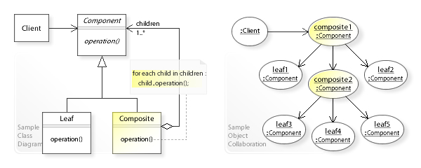

= Simulation Construction
:url-composite: https://en.wikipedia.org/wiki/Composite_pattern
:imagesdir:../images
:data-uri:

Building a Sparta Model requires establishing component hierarchies
and relationships that will be used during similation.  This
establishment is used to represent all of the components instantiated
by Sparta as well as those components created by the modeler to build,
connect, run, observe, and destroy the simulation.

This chapter will go over the class structures used to build a running
simulator.  The chapter will first introduce the modeler to the base
classes used to make up a simulation environment then will show how to
use those classes to form the final simulation.

== Sparta Classes for Simulation

As an example of a simulation heirarchy, take a generic SoC design
which consists of multiple cores and a memory subsytem (`mss`).  Each
core consists of subcomponents (`fetch`, `decode`, `rename`, etc).
[plantuml,align="center"]
....
@startuml
(top) --> (cpu)
(top) --> (mss)
(cpu) --> (core0)
(cpu) --> (core1)
(core0) --> (fetch)
(core0) --> (decode)
(core0) --> (rename)
(core0) --> (dispatch)
(core0) --> (exe)
(core0) --> (lsu)
(core0) --> (retire)
(core1) --> (...repeats)
@enduml
....

The `top` level node is, by default, named `top` and is the root of all components in the example SoC.

****
Note that in Sparta, a "root" tree node is always of type
https://sparcians.github.io/map/classsparta_1_1RootTreeNode.html[sparta::RootTreenode]
called `top` if constructed without a name.  This `top` node is
created automatically when a
https://sparcians.github.io/map/classsparta_1_1app_1_1Simulation.html[sparta::app::Simulation]
object is instantiated (https://sparcians.github.io/map/classsparta_1_1app_1_1Simulation.html#a50d046cc0b13d2776fb51813bfa7b0c5[sparta::app::Simulation::getRoot()])..
****

Each node of the heirarchy represents a
https://sparcians.github.io/map/classsparta_1_1TreeNode.html[sparta::TreeNode]
which is the main "node container".  This container will hold
everything related to that component like the component's
https://sparcians.github.io/map/classsparta_1_1ParameterSet.html[ParameterSet],
https://sparcians.github.io/map/classsparta_1_1PortSet.html[PortSet],
https://sparcians.github.io/map/classsparta_1_1StatisticSet.html[StatisticSet], and the modeler's specific
https://sparcians.github.io/map/classsparta_1_1Unit.html[Unit].

The modeler is responsible for creating these nodes, establishing the
relationships between them, and eventually destroying them.  This
relationship is built on top of the {url-composite}[Composite
Pattern] from Design Patterns.

[#Composite Pattern,link="https://en.wikipedia.org/wiki/Composite_pattern#/media/File:W3sDesign_Composite_Design_Pattern_UML.jpg"]


This heirarchy and component relationship is what will be represented
in simulation and is at the heart of the Sparta Simulation Framework.
Everything in simulation refers to these constructed artifacts and
their relationships.

After component relationship is established, the diagram will consist
of the following classes/relationships:
[plantuml,align="center"]
....
@startuml
class sparta::TreeNode {
 -children_[] : sparta::TreeNode
 -parent_ *  : sparta::TreeNode
}
class sparta::RootTreeNode
class sparta::ResourceTreeNode {
 -resource_ : sparta::Resource
}

sparta::TreeNode <|-- sparta::RootTreeNode
sparta::RootTreeNode --> sparta::TreeNode
sparta::TreeNode <|-- sparta::ResourceTreeNode
sparta::ResourceTreeNode --> sparta::TreeNode

class sparta::Unit {
 #port_set_ : sparta::PortSet
 #statistic_set_ : sparta::StatisticSet
}

class sparta::Resource {
 +getContainer() : sparta::TreeNode
}
sparta::Resource --> sparta::TreeNode
sparta::Resource <|-- sparta::Unit

sparta::ResourceTreeNode *- sparta::Resource : owns/creates

class my_model::Core
class my_model::Fetch
class my_model::Decode
class my_model::Rename
class my_model::etc

sparta::Unit <|-- my_model::Core
sparta::Unit <|-- my_model::Fetch
sparta::Unit <|-- my_model::Decode
sparta::Unit <|-- my_model::Rename
sparta::Unit <|-- my_model::etc

@enduml
....
Note that `sparta::RootTreeNode` and `sparta::ResourceTreeNode` being
of type `sparta::TreeNode` contain a list of children `sparta::TreeNode` objects as well as 1
parent.  A `sparta::TreeNode` cannot have more than 1 parent.

After the building of the simulation environment, from the modeler's
point of view, relationships will look like the following.

[plantuml,align="center"]
....
@startuml


class sparta::top

class my_model::Core
class my_model::MSS
class my_model::Fetch
class my_model::Decode
class my_model::Rename

sparta::top -> my_model::Core
sparta::top -> my_model::MSS
my_model::Core --> my_model::Fetch
my_model::Core --> my_model::Decode
my_model::Core --> my_model::Rename
my_model::Core --> my_model::etc

@enduml
....

However, accessing one component (`Core` -> `Fetch` as an example) is
not direct, but rather through the containers in which they reside:
```
   my_core->getContainer()->getChildren ... etc
```

This is highly discouraged, however, as resources should not be
accessing each other directly. Instead, resources should communicate
through https://sparcians.github.io/map/communication.html#comm_ports[`sparta::Ports`].

=== Sparta TreeNode

As mentioned above, Sparta requires a modeler to build a simulation
heirarchy to represent those components in simulation.  Each of those
nodes is, or a derivative of, a `sparta::TreeNode`.

Referring back to the Composite Pattern, `sparta::TreeNode` _is-a_
Component, a Leaf, and a Composite.  When the modeler creates the
tree, that modeler is actually creating `sparta::TreeNode` instances
to reside in the tree and then establishes parent-child relationships between them.

In practice, the modeler will most likely construct a:
https://sparcians.github.io/map/classsparta_1_1ResourceTreeNode.html[sparta::ResourceTreeNode]
derived type.  This class is a special type of `sparta::TreeNode` that
allows Sparta to instantiate and maintain model-specific units and
components used in simulation.

=== Sparta ResourceTreeNode

The
https://sparcians.github.io/map/classsparta_1_1ResourceTreeNode.html[`sparta::ResourceTreeNode`]
is a derivative class of `sparta::TreeNode` and is aware of modeling
resources that need to be instantiated including the modeler's
specific derivative of the `sparta::Unit` or `sparta::Resource`.

Specifically, the `sparta::ResourceTreeNode` is the main container for the following components:

1. `sparta::Unit` -- The base class that the modeler will create his/her component from
1. `sparta::ParameterSet` -- The parameters used by the modeler's `sparta::Unit` to configure

The `sparta::ResourceTreeNode` will instantiate the modeler's unit as
well as the parameters it uses.  However, by itself, the
`sparta::ResourceTreeNode` does not know how to to instantiate the
modeler's modeling components.  To instantiate those components,
`sparta::ResourceTreeNode` requires the modeler to provide an instance
of a
https://sparcians.github.io/map/classsparta_1_1ResourceFactory.html[`sparta::ResourceFactory`]
or a derivative of
https://sparcians.github.io/map/classsparta_1_1ResourceFactoryBase.html[`sparta::ResourceFactoryBase`]

https://en.wikipedia.org/wiki/Factory_method_pattern[Factories] are a common practice in software development, allowing a
framework to remain type-agnostic, but giving an opportunity for the
user to instantiate their own instance of a class.

[#Factory Pattern,link="https://upload.wikimedia.org/wikipedia/commons/4/43/W3sDesign_Factory_Method_Design_Pattern_UML.jpg"]
image::../images/W3sDesign_Factory_Method_Design_Pattern_UML.jpg[The Factory Design Pattern,align=center]

For convenience, Sparta provides the generic derived factory
https://sparcians.github.io/map/classsparta_1_1ResourceFactory.html[`sparta::ResourceFactory`]
if the modeler has no special construction requirements.  See the
<<Factories>> section to learn how to create a custom factory to build
specialized simulation tree structures.

During finalization of the framework (documented in the next section),
the `sparta::ResourceTreeNode` will use the given factory to
instantiate the user defined modeling component.

== Building the Simulation Heirarchy

The simulation heirarchy can be built anywhere, including a simple
application that just contains `main()` and starts with a
`sparta::RootTreeNode`.  However, to take advantage of Sparta's
built-in command line parsing, automatic phase construction, automatic
report generation, and other powerful components, using Sparta's
`sparta::app::Simulation` class is a cleaner choice.

=== Sparta Simulation

A Sparta-based simulator starts with the modeler providing a derivated
instantiated instance of
https://sparcians.github.io/map/classsparta_1_1app_1_1Simulation.html[`sparta::app::Simulation`].

This class provides a default `sparta::RootTreeNode` that can be used
immediately.  When this class is coupled with
`sparta::app::CommandLine`, Sparta is now more "entrenched" in the
modeler's simulator.

To start a new simulation, provide a derivative of
`sparta::app::Simulation`.  Initialize the Simulation with the name of
the simulator (user defined) and an instance of the
`sparta::Scheduler` (more on that later).

[source,cpp]
----
////////////////////////////////////////////////////////////////////////////////
// MySimulator.hpp

#pragma once

#include "sparta/app/Simulation.hpp"
#include "sparta/kernek/Scheduler.hpp"

namespace my_simulator
{
    class MySimulator : public sparta::app::Simulation
    {
    public:
        // User defined simulation behaviors as well as overrides
        MySimulator(/* custom args */) :
            sparta::app::Simulation("my_simulator", &scheduler_)
        { // user defined setups  }

    private:
        sparta::Scheduler scheduler_{"my_scheduler"};
    };
}


int main()
{
    MySimulator my_sim;
    (void) my_sim;
    return 0;
}

----
Typical usecase is the modeler provides 1 instance of this object _per
simulation_, but there's nothing in the framework that restricts this.

At this point, the modeler has created the _beginnings_ of a
simulator, but it does not contain any heirarchy nor any instantiated
modeling components.

The building of the simulation heirarchy is done in stages, with each
stage alloing the modeler define the heirarchy, configure the
heirarchy, allow the framework to instantiate the simulator, and then
finally the stage to allow the modeler to bind all of the components
together.

These stages are done automatically for the modeler via the
`sparta::app::Simulation` class.  The class will guide the
modeler through these phases:

- <<build>>Define the user-defined modeling components in simulation
   and their initial relationships.  This builds the composite tree.
-  <<configure>>Allow the user to present or override configurations
   before the simulation is instantiated.  This allows changes in
   topology or behaviors.
- <<instantiate>> – (Internal) Construct user-defined modeling
   components registered during Build and configured during Configure.
   The composite tree is now locked.
- <<bind>> – (Internal) Connect all the user-defined modeling components
   together to establish final communication flow

==== Build Phase [[build]]

The virtual method
https://sparcians.github.io/map/classsparta_1_1app_1_1Simulation.html#aecc889666b5da1b6891a6f1ed337fbc8[`sparta::app::Simulation::buildTree_()] will be called via
https://sparcians.github.io/map/classsparta_1_1app_1_1Simulation.html#a319e9c4e7418f8f953e1a527b4feff8a[sparta::app::Simulation::buidlTree()]
in the plubic API:

[source,cpp]
----
int main()
{
    MySimulator my_sim;
    my_sim.buildTree(); // Build the TreeNode hierarchy
    return 0;
}
----

The *Build* phase is the first phase of simulation construction where
the modeler is expected to create `sparta::TreeNode` derivative types
and establish relationships (parent and child) between those nodes.
This is creating and setting up _pure_ Sparta componentry and the
modeler's units/classes will not be created in this phase.

To create the CPU heirarchy above, the modeler must override the
protected `virtual` method `void buildTree_()` in the
`sparta::app::Simulation` derivative.  In this method, the modeler
will create the heirarchy of `sparta::ResourceTreeNode` objects that
represent, or contain, each of the modeler's units to be instantiated
in simulation.

The modeler is responsible for creating and destroying those objects.

****
A rule of thumb when using the Sparta Modeling Framework: if *you* call `new` *you*
must call `delete`.  The framework will never require the modeler to
delete anything that it has created nor will it delete anything for you.
****

[source,cpp]
----
#pragma once

#include <vector>
#include <memory>

#include "sparta/app/Simulation.hpp"
#include "sparta/kernel/Scheduler.hpp"

// Forward declare
namespace sparta { class TreeNode; }

namespace my_simulator
{
    // MySimulator.hpp
    class MySimulator : public sparta::app::Simulation
    {
        // ... construction code

    private:

        // Override sparta::app::Simulation's method
        void buildTree_() override final;
        std::vector<std::unique_ptr<sparta::TreeNode>> tns_to_delete_;

        // Other user defined private member variables/methods...
    };
}
----

In the source file, implement the `buildTree_` method and create the
node heirarchy.  Still realize that **none** of the modeler's components
have been instantiated at end of this phase.

[.underline]
`buildTree_` Implementation Notes

Each `ResourceTreeNode` that is constructed takes the following:

- It's parent tree node
- A unique name for that node.  Rules do apply to this name.  The name
  must be python compatible meaning only alpha-numeric characters.
- The group name if there is more than 1 node of the same name.  For
  example, in the code above, there are 2 cores: `core0` and `core1`.
  The group name is `core`
- The group index is the number being instantiated.  For the `core`
  example, this is 0 then 1.
- The description
- The factory used to instantiate the modeler's component during the <<instantiate>>

[source,cpp]
----
////////////////////////////////////////////////////////////////////////////////
// MySimulator.cpp

#include <cinttypes>
#include <string>

#include "MySimulator.hpp"

// Modeler's components
#include "CPU.hpp"
#include "Core.hpp"
#include "MSS.hpp"

// Sparta Components
#include "sparta/simulation/ResourceTreeNode.hpp"
#include "sparta/simulation/Factory.hpp"

namespace my_simulator
{
    MySimulator::MySimulator() :
        sparta::app::Simulation("my_simulator", &scheduler_)
    {
       // User defined operations + resource factory registration

       // Register resource factories with the Simulation class that
       // tell Sparta how to instantiate both the modeler's classes and
       // its parameters.
       getResourceSet()->
           addResourceFactory<sparta::ResourceFactory<CPU, CPU::CPUParameters>>();
       getResourceSet()->
           addResourceFactory<sparta::ResourceFactory<Core, Core::CoreParameters>>();
       getResourceSet()->
           addResourceFactory<sparta::ResourceFactory<MSS, MSS::MSSParameters>>();
    }

    void MySimulator::buildTree_()
    {
        auto root_tn = getRoot();  // get the RootTreeNode "top"

        // Create the CPU node, a child of the root tree node
        sparta::ResourceTreeNode* cpu_tn =
            new sparta::ResourceTreeNode(root_tn,
                                         CPU::name,
                                         // Only allow 1 CPU object
                                         sparta::TreeNode::GROUP_NAME_NONE,
                                         sparta::TreeNode::GROUP_IDX_NONE,
                                         "My CPU instance",
                                         getResourceSet()->getResourceFactory(CPU::name));

        // _We_ created the ResourceTreeNode, so _we_ must delete it
        tns_to_delete_.emplace_back(cpu_tn);

        // Create the CPU nodes, children of the CPU TreeNode.  For
        // sake of brevity, assume a simulation of just 2 cores.  This
        // can be parameterized either on the command line (shown later)
        // or via parameters.
        constexpr uint32_t num_cores = 2;
        for (uint32_t core_num; core_num < num_cores; ++core_num)
        {
            sparta::ResourceTreeNode* core_tn =
                new sparta::ResourceTreeNode(cpu_tn,
                                             // The name _must_ be unique
                                             Core::name + std::to_string(core_num),
                                             "core",
                                             core_num,
                                             "My core" + std::to_string(core_num) + " instance",
                                             getResourceSet()->getResourceFactory(Core::name));

            // _We_ created the ResourceTreeNode, so _we_ must delete it
            tns_to_delete_.emplace_back(core_tn);
        }

        // Create the MSS node, a child of the root tree node
        sparta::ResourceTreeNode* mss_tn =
            new sparta::ResourceTreeNode(root_tn,
                                         MSS::name,
                                         // Only allow 1 CPU object
                                         sparta::TreeNode::GROUP_NAME_NONE,
                                         sparta::TreeNode::GROUP_IDX_NONE,
                                         "My MSS instance",
                                         getResourceSet()->getResourceFactory(MSS::name));

        // _We_ created the ResourceTreeNode, so _we_ must delete it
        tns_to_delete_.emplace_back(mss_tn);
    }
}
----

Looking at `MySimulator`'s constructor in more detail, for Sparta to
instantiate the modeling-specific class instances, the modeler must
provide a factory that the `ResourceTreeNode` will use to create it.

One way to build these factory instances is to allow Sparta to
maintain them in the Simulation class directly via the call to
`addResourceFactory` from an internal `ResourceSet`:
`getResourceSet()->addResourceFactory<FactoryT>(...)`.  Then, the
modeler can retrieve these factory instances later when creating the
`sparta::ResourceTreeNode`:

[source,cpp]
----
sparta::ResourceTreeNode* cpu_tn =
    new sparta::ResourceTreeNode(root_tn,
                                 CPU::name,
                                 // Only allow 1 CPU object
                                 sparta::TreeNode::GROUP_NAME_NONE,
                                 sparta::TreeNode::GROUP_IDX_NONE,
                                 "My CPU instance",
                                 getResourceSet()->getResourceFactory(Core::name));
----

This methodology is preferred as it allows the framework to construct,
use, and destroy the factories for you in the order that is preferable
to flow of simulation.

However, "stashing" the factory into the internal resource set is not
required.  Instead, a modeler can create and maintain his/her own
factories in the private section of the Simulation instance:

[source,cpp]
----
namespace my_simulator
{
    class MySimulator ...
    {
    private:
        // An instance of the CPU factory, used locally
        sparta::ResourceFactory<CPU, CPU::CPUParameters> cpu_factory_;

        std::vector<std::unique_ptr<sparta::TreeNode>> tns_to_delete_;
    };
}
----
and then pass a pointer to that factory to the constructor of the ResourceTreeNode:
[source,cpp]
----
sparta::ResourceTreeNode* cpu_tn =
    new sparta::ResourceTreeNode(root_tn,
                                 CPU::name,
                                 // Only allow 1 CPU object
                                 sparta::TreeNode::GROUP_NAME_NONE,
                                 sparta::TreeNode::GROUP_IDX_NONE,
                                 "My CPU instance",
                                 &cpu_factory_);  // use local factory
----

This is useful if the modeler has a collection of pre-mode factories
to be reused.  However, there is one important caveat if a modeler
chooses to do this:

[.text-left]
[.red]**The factory must outlive the ResourceTreeNode it's associated with.**

In other words, the factory must be destroyed _after_ the
ResourceTreeNode is destroyed.  The factory is used to destruct the
ResourceTreeNode's internal components properly.

==== Configure Phase [[configure]]

The virtual method
https://sparcians.github.io/map/classsparta_1_1app_1_1Simulation.html#a9d83dfcb8bf3490bff0e26b08f84c4bf[sparta::app::Simulation::configureTree_()] will be called from the public API call https://sparcians.github.io/map/classsparta_1_1app_1_1Simulation.html#a54a0e00d7f5998fec76bb62061a475ed[sparta::app::configureTree()].

[source,cpp]
----
int main()
{
    MySimulator my_sim;
    my_sim.buildTree();     // Build the TreeNode hierarchy
    my_sim.configureTree(); // Configure/adjust parameters before instantiation
    return 0;
}
----

Most modelers will not perform any explicit configurations, but at
this point in simulation construction, the modeler can grab the
`sparta::ParameterSet` instances from `sparta::ResourceTreeNode` that
are associated with _any_ of the modeled components to make
adjustments, check for errors, etc.

The `sparta::ParameterSet` objects are created by the
`sparta::ResourceTreeNode` found in the tree node heirarchy.

[source,cpp]
----
#pragma once

#include <vector>
#include <memory>

#include "sparta/app/Simulation.hpp"
#include "sparta/kernel/Scheduler.hpp"

// Forward declare
namespace sparta { class TreeNode; }

namespace my_simulator
{
    // MySimulator.hpp
    class MySimulator : public sparta::app::Simulation
    {
        // ... construction code

    private:

        // Override sparta::app::Simulation's method
        void buildTree_() override final;
        void configureTree_() override final;

        std::vector<std::unique_ptr<sparta::TreeNode>> tns_to_delete_;

        // Other user defined private member variables/methods...
    };
}
----


[source,cpp]
----
namespace my_simulator
{
    void MySimulator::configureTree_()
    {

        // The modeler can now grab sparta::ParameterSets and specific
        // Parameters to check for sanity, etc.  This can be either const or non-const
        const auto core_rtn = getRoot()->getChildAs<sparta::ResourceTreeNode>(CPU::name);
        const sparta::ParameterSet * core_parameters = core_rtn->getParameterSet();
        const sparta::Parameter<uint32_t> & num_branch_units =
            core_parameters->getParameterAs<uint32_t>("num_branch_units");
         sparta_assert(num_branch_units == 1, "This core design only suppoerts 1 branch unit");
    }
}
----

==== Instantiate Phase [[instantiate]]

Instantiating the components of simulation is a sparta-internal
effort, but the phase is stil started by the user by calling
https://sparcians.github.io/map/classsparta_1_1app_1_1Simulation.html#a200bdd31a21e24a242770fcb8e7fff5f(`sparta::app::Simulation::finalizeTree()`)

[source,cpp]
----
int main()
{
    MySimulator my_sim;
    my_sim.buildTree();     // Build the TreeNode hierarchy
    my_sim.configureTree(); // Configure/adjust parameters before instantiation
    my_sim.finalizeTree();  // Finialize and lock in parameters; instantiate the model
    return 0;
}
----

During this phase, the `sparta::ParameterSet` classes are locked to
disallow parameter changes, but the tree is still malleable meaning is
can be extended with even more subcomponents in the modeler's
constructor.  See <<advanced_features>> for examples.

Also during the call to `finalizeTree`, the framework will traverse
the tree built in <<build>>, look for `sparta::ResourceTreeNode`
objects, and instruct them to instantiate the modeler's specific
implementation of a `sparta::Unit`.

After the modeler's components (instances of `sparta::Unit`) are
created, the framework will automatically turn to binding those
components and enters the <<bind>>.

==== Bind Phase [[bind]]


==== Running the Simulation

== Factories [[factories]]

== Commandline Simulation

== More Advanced Simulation Construction
