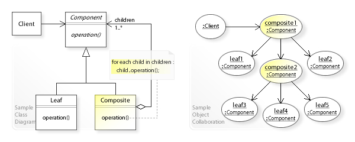
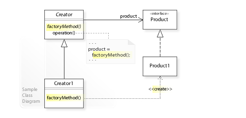

= Simulation Construction
:url-composite: https://en.wikipedia.org/wiki/Composite_pattern
:url-factory: https://en.wikipedia.org/wiki/Factory_method_pattern
:url-doxygen-simulation: https://sparcians.github.io/map/classsparta_1_1app_1_1Simulation.html
:url-doxygen-treenode: https://sparcians.github.io/map/classsparta_1_1TreeNode.html
:url-doxygen-roottreenode: https://sparcians.github.io/map/classsparta_1_1RootTreeNode.html
:url-doxygen-resourcetreenode: https://sparcians.github.io/map/classsparta_1_1ResourceTreeNode.html
:url-doxygen-resourcefactory: https://sparcians.github.io/map/classsparta_1_1ResourceFactory.html
:url-doxygen-resourcefactorybase: https://sparcians.github.io/map/classsparta_1_1ResourceFactoryBase.html
:url-doxygen-parameterset: https://sparcians.github.io/map/classsparta_1_1ParameterSet.html
:url-doxygen-portset: https://sparcians.github.io/map/classsparta_1_1PortSet.html
:url-doxygen-statisticset: https://sparcians.github.io/map/classsparta_1_1StatisticSet.html
:url-doxygen-unit: https://sparcians.github.io/map/classsparta_1_1Unit.html
:url-doxygen-resource: https://sparcians.github.io/map/classsparta_1_1Resource.html
:url-doxygen-cmdlinesim: https://sparcians.github.io/map/classsparta_1_1app_1_1CommandLineSimulator.html
:data-uri:

Building a Sparta model requires establishing hierarchies and
relationships between modeling resources that will exist during
simulation.  This establishment enables Sparta to maintain
relationships between resources created by the modeler during the
building, connection, running, observing, and destruction of
simulation.

The modeler defines the "resource" as an actual hardware component; a
resource can be the Rename block of a CPU model or a DDR controller.
However, in hierarchies there can also be placeholders to establish
relationships (but are not part of the model nor its simulation).
These placeholders are simple nodes.

This chapter will go over the class structures used to establish the
hierarchies with nodes and resources by first introducing the modeler
to Sparta's base classes used to make up a simulator then and then
illustrate how to use those classes to form the final simulation.

== Sparta Classes for Simulation

As an example of a simulation hierarchy, take a generic SoC design
which consists of multiple cores and a memory subsystem (`mss`).  Each
core consists of subresources (`fetch`, `decode`, `rename`, etc).
Each named object in the graph is considered a node or placeholder.
The resource (if appropriate) will be instantiated later.

[plantuml,format="png",align="center"]
....
@startuml
(top) --> (core)
(top) --> (mss)
(core) --> (fetch)
(core) --> (decode)
(core) --> (rename)
(core) --> (dispatch)
(core) --> (exe)
(core) --> (lsu)
(core) --> (retire)
@enduml
....

The `top` level node is, by default, named `top` and is the root of
all resources in the example SoC.  In Sparta, this is known as the
`sparta::RootTreeNode`.  Simulation typically contains one
`sparta::RootTreeNode`, but nothing in the framework disallows
multiple roots.

****
Note that in Sparta, a "root" tree node is always of type
{url-doxygen-roottreenode}[sparta::RootTreeNode]
called `top` if constructed without a name.  This `top` node is
created automatically when a
{url-doxygen-simulation}[sparta::app::Simulation]
object is instantiated ({url-doxygen-simulation}#a50d046cc0b13d2776fb51813bfa7b0c5[sparta::app::Simulation::getRoot()]).
****

Each node of the hierarchy represents a
{url-doxygen-treenode}[sparta::TreeNode] which is the main "node
container."  This container will hold everything related to that
component like the component's
{url-doxygen-parameterset}[ParameterSet],
{url-doxygen-portset}[PortSet],
{url-doxygen-statisticset}[StatisticSet], and the modeler's specific
{url-doxygen-unit}[Unit].

The modeler is responsible for creating these nodes, establishing the
relationships between them, and eventually destroying them.  This
relationship is built on top of the {url-composite}[Composite
Pattern] from Design Patterns.

[#Composite Pattern,link="https://en.wikipedia.org/wiki/Composite_pattern#/media/File:W3sDesign_Composite_Design_Pattern_UML.jpg"]


This hierarchy and component relationship is what will be represented
in simulation and is at the heart of the Sparta Simulation Framework
and the modeler's simulator.  Everything in simulation refers to these
constructed artifacts and their relationships.

The modeler begins simulator development by creating a representation
of the graph using `sparta::TreeNode` objects for placeholders and
`sparta::ResourceTreeNode` for resources.

=== Sparta TreeNode

As mentioned above, Sparta requires a modeler to build a simulation
hierarchy to represent those resources in simulation.  Each of those
nodes is, or a derivative of, a `sparta::TreeNode`.

Referring back to the Composite Pattern, `sparta::TreeNode` _is-a_
Component, a Leaf, and a Composite.  When the modeler creates the
tree, that modeler is actually creating `sparta::TreeNode` instances
to reside in the tree and then establishes parent-child relationships
between them.

In practice, the modeler will most likely construct a
{url-doxygen-resourcetreenode}[sparta::ResourceTreeNode]
derived type.  This class is a special type of `sparta::TreeNode` that
allows Sparta to instantiate and maintain model-specific units and
resources used in simulation.

=== Sparta ResourceTreeNode

The {url-doxygen-resourcetreenode}[`sparta::ResourceTreeNode`] is a
derivative class of `sparta::TreeNode` and is aware of modeling
resources that need to be instantiated including the modeler's
specific derivative of a `sparta::Unit` or `sparta::Resource`.

Specifically, the `sparta::ResourceTreeNode` is the main container for
the following resources:

1. `sparta::Unit` -- The base class that the modeler will create their component from (`Fetch`, `Decode`, etc)
1. `sparta::ParameterSet` -- The parameters used by the modeler's `sparta::Unit` to configure (`FetchParameterSet`, `DecodeParameterSet`, etc)

The `sparta::ResourceTreeNode` will instantiate the modeler's unit as
well as the parameters it uses.  However, by itself, the
`sparta::ResourceTreeNode` does not know how to instantiate the
modeler's modeling resources.  To instantiate those resources,
`sparta::ResourceTreeNode` requires the modeler to provide an instance
of a {url-doxygen-resourcefactory}[`sparta::ResourceFactory`] or a
derivative of
{url-doxygen-resourcefactorybase}[`sparta::ResourceFactoryBase`].

{url-factory}[Factories] are a common practice in software
development, allowing a framework to remain type-agnostic, but giving
an opportunity for the user to instantiate their own instance of a
class.

[#Factory Pattern,link="https://upload.wikimedia.org/wikipedia/commons/4/43/W3sDesign_Factory_Method_Design_Pattern_UML.jpg"]


For convenience, Sparta provides the generic derived factory
{url-doxygen-resourcefactory}[`sparta::ResourceFactory`] if the
modeler has no special construction requirements.  See the
<<Factories>> section to learn how to create a custom factory to build
specialized simulation tree structures.

During finalization of the framework (documented in the next section),
the `sparta::ResourceTreeNode` will use the given factory to
instantiate the user-defined modeling component.

== Building the Simulation Hierarchy

The simulation hierarchy can be built anywhere, including a simple
application that just contains `main()` and starts with a
`sparta::RootTreeNode`.  However, to take advantage of Sparta's
built-in command line parsing, automatic phase construction, automatic
report generation, and other powerful resources, using Sparta's
`sparta::app::Simulation` class is the cleaner choice.

=== Sparta Simulation

A Sparta-based simulator starts with the modeler providing a derived
instance of
{url-doxygen-simulation}[`sparta::app::Simulation`].

This class provides a default `sparta::RootTreeNode` that can be used
immediately.  When this class is coupled with
`sparta::app::CommandLineSimulator`, Sparta is now more "entrenched" in
the modeler's simulator.

To start a new simulation, provide a derivative of
`sparta::app::Simulation`.  Initialize the Simulation with the name of
the simulator (user defined) and an instance of the
`sparta::Scheduler` (more on that later).

[source,cpp]
----
////////////////////////////////////////////////////////////////////////////////
// MySimulator.hpp

#pragma once

#include "sparta/app/Simulation.hpp"
#include "sparta/kernel/Scheduler.hpp"

namespace my_simulator
{
    class MySimulator : public sparta::app::Simulation
    {
    public:
        MySimulator(/* custom args */) :
            sparta::app::Simulation("my_simulator", &scheduler_)
        { /* user defined setups */ }

    private:
        sparta::Scheduler scheduler_{"my_scheduler"};
    };
}


int main()
{
    my_simulator::MySimulator my_sim;
    (void) my_sim;
    return 0;
}

----

The typical use case is for the modeler to provide one instance of this
object _per simulation_, but there is nothing in the framework that
restricts this.

At this point, the modeler has created the _beginnings_ of a
simulator, but it does not contain any hierarchy nor any instantiated
modeling resources.

The building of the simulation hierarchy is done in stages, with each
stage allowing the modeler to define the hierarchy, configure the
hierarchy, allow the framework to instantiate the simulator, and then
finally allowing the modeler to bind all of the resources together.

These stages are done automatically for the modeler via the
`sparta::app::Simulation` class.  The class will guide the
modeler through these phases:

- <<build>> -- Define the user-defined modeling resources in simulation
   and their initial relationships.  This builds the composite tree.
- <<configure>> -- Allow the user to present or override configurations
   before the simulation is instantiated.  This allows changes in
   topology or behaviors.
- <<instantiate>> -- (Internal) Construct user-defined modeling
   resources registered during Build and configured during Configure.
   The composite tree is now locked.
- <<bind>> -- (Internal) Connect all the user-defined modeling resources
   together to establish final communication flow.

==== Build Phase [[build]]

The virtual method
{url-doxygen-simulation}#aecc889666b5da1b6891a6f1ed337fbc8[`sparta::app::Simulation::buildTree_()`] will be called via
{url-doxygen-simulation}#a319e9c4e7418f8f953e1a527b4feff8a[`sparta::app::Simulation::buildTree()`]
in the public API:

[source,cpp]
----
int main()
{
    my_simulator::MySimulator my_sim;
    my_sim.buildTree(); // Build the TreeNode hierarchy
    return 0;
}
----

The *Build* phase is the first phase of simulation construction where
the modeler is expected to create `sparta::TreeNode` derivative types
and establish relationships (parent and child) between those nodes.
This is creating and setting up _pure_ Sparta componentry -- the
modeler's units and classes will not be created in this phase.

To create the CPU hierarchy above, the modeler must override the
protected `virtual` method `void buildTree_()` in the
`sparta::app::Simulation` derivative.  In this method, the modeler
will create the hierarchy of `sparta::ResourceTreeNode` objects that
represent, or contain, each of the modeler's units to be instantiated
in simulation.

The modeler is responsible for creating and destroying those objects.

****
A rule of thumb when using the Sparta Modeling Framework: if _you_ call
`new`, _you_ must call `delete`.  The framework will never require the
modeler to delete anything that it has created, nor will it delete
anything for you.
****

[source,cpp]
----
#pragma once

#include <vector>
#include <memory>

#include "sparta/app/Simulation.hpp"
#include "sparta/kernel/Scheduler.hpp"

// Forward declare
namespace sparta { class TreeNode; }

namespace my_simulator
{
    // MySimulator.hpp
    class MySimulator : public sparta::app::Simulation
    {
        // ... construction code

    private:

        // Override sparta::app::Simulation's method
        void buildTree_() override final;
        std::vector<std::unique_ptr<sparta::TreeNode>> tns_to_delete_;

        // Other user defined private member variables/methods...
    };
}
----

In the source file, implement the `buildTree_` method and create the
node hierarchy.  Note that *none* of the modeler's resources have
been instantiated at the end of this phase.

[.underline]
`buildTree_` Implementation Notes

Each `ResourceTreeNode` that is constructed takes the following:

- Its parent tree node
- A unique name for that node.  Rules do apply to this name.  The name
  must be Python compatible -- only alphanumeric characters and underscores.
- The group name if there is more than one node of the same name.  For
  example, in the code below, there are 2 cores: `core0` and `core1`.
  The group name is `core`.
- The group index is the number being instantiated.  For the `core`
  example, this is 0 then 1.
- The description
- The factory used to instantiate the modeler's component during <<instantiate>>

[source,cpp]
----
////////////////////////////////////////////////////////////////////////////////
// MySimulator.cpp

#include <cinttypes>
#include <string>

#include "MySimulator.hpp"

// Modeler's resources
#include "CPU.hpp"
#include "Core.hpp"
#include "MSS.hpp"

// Sparta Resources
#include "sparta/simulation/ResourceTreeNode.hpp"
#include "sparta/simulation/Factory.hpp"

namespace my_simulator
{
    MySimulator::MySimulator() :
        sparta::app::Simulation("my_simulator", &scheduler_)
    {
       // Register resource factories with the Simulation class that
       // tell Sparta how to instantiate both the modeler's classes and
       // their parameters.
       getResourceSet()->
           addResourceFactory<sparta::ResourceFactory<CPU, CPU::CPUParameters>>();
       getResourceSet()->
           addResourceFactory<sparta::ResourceFactory<Core, Core::CoreParameters>>();
       getResourceSet()->
           addResourceFactory<sparta::ResourceFactory<MSS, MSS::MSSParameters>>();
    }

    void MySimulator::buildTree_()
    {
        auto root_tn = getRoot();  // get the RootTreeNode "top"

        // Create the CPU node, a child of the root tree node
        sparta::ResourceTreeNode* cpu_tn =
            new sparta::ResourceTreeNode(root_tn,
                                         CPU::name,
                                         sparta::TreeNode::GROUP_NAME_NONE,
                                         sparta::TreeNode::GROUP_IDX_NONE,
                                         "My CPU instance",
                                         getResourceSet()->getResourceFactory(CPU::name));

        // _We_ created the ResourceTreeNode, so _we_ must delete it
        tns_to_delete_.emplace_back(cpu_tn);

        // Create the core nodes, children of the CPU TreeNode.  For
        // brevity, assume a simulation of just 2 cores.  This
        // can be parameterized either on the command line (shown later)
        // or via parameters.
        constexpr uint32_t num_cores = 2;
        for (uint32_t core_num = 0; core_num < num_cores; ++core_num) // <1>
        {
            sparta::ResourceTreeNode* core_tn =
                new sparta::ResourceTreeNode(cpu_tn,
                                             Core::name + std::to_string(core_num),
                                             "core",
                                             core_num,
                                             "My core " + std::to_string(core_num) + " instance",
                                             getResourceSet()->getResourceFactory(Core::name));

            // _We_ created the ResourceTreeNode, so _we_ must delete it
            tns_to_delete_.emplace_back(core_tn);
        }

        // Create the MSS node, a child of the root tree node
        sparta::ResourceTreeNode* mss_tn =
            new sparta::ResourceTreeNode(root_tn,
                                         MSS::name,
                                         sparta::TreeNode::GROUP_NAME_NONE,
                                         sparta::TreeNode::GROUP_IDX_NONE,
                                         "My MSS instance",
                                         getResourceSet()->getResourceFactory(MSS::name));

        // _We_ created the ResourceTreeNode, so _we_ must delete it
        tns_to_delete_.emplace_back(mss_tn);
    }
}
----
<1> Always initialize loop variables.  An uninitialized `uint32_t` loop
counter produces undefined behavior even though it often works in
practice.

Looking at `MySimulator`'s constructor in more detail: for Sparta to
instantiate the modeling-specific class instances, the modeler must
provide a factory that the `ResourceTreeNode` will use to create it.

One way to build these factory instances is to allow Sparta to
maintain them in the Simulation class directly via the call to
`addResourceFactory` from an internal `ResourceSet`:
`getResourceSet()->addResourceFactory<FactoryT>(...)`.  The
modeler can then retrieve these factory instances later when creating
`sparta::ResourceTreeNode` objects:

[source,cpp]
----
sparta::ResourceTreeNode* cpu_tn =
    new sparta::ResourceTreeNode(root_tn,
                                 CPU::name,
                                 sparta::TreeNode::GROUP_NAME_NONE,
                                 sparta::TreeNode::GROUP_IDX_NONE,
                                 "My CPU instance",
                                 getResourceSet()->getResourceFactory(CPU::name));
----

This methodology is preferred as it allows the framework to construct,
use, and destroy the factories in the order that is preferable
to the flow of simulation.

However, stashing the factory into the internal resource set is not
required.  Instead, a modeler can create and maintain their own
factories in the private section of the Simulation instance:

[source,cpp]
----
namespace my_simulator
{
    class MySimulator ...
    {
    private:
        // An instance of the CPU factory, used locally
        sparta::ResourceFactory<CPU, CPU::CPUParameters> cpu_factory_;

        std::vector<std::unique_ptr<sparta::TreeNode>> tns_to_delete_;
    };
}
----

and then pass a pointer to that factory to the constructor of the
`ResourceTreeNode`:

[source,cpp]
----
sparta::ResourceTreeNode* cpu_tn =
    new sparta::ResourceTreeNode(root_tn,
                                 CPU::name,
                                 sparta::TreeNode::GROUP_NAME_NONE,
                                 sparta::TreeNode::GROUP_IDX_NONE,
                                 "My CPU instance",
                                 &cpu_factory_);  // use local factory
----

This is useful if the modeler has a collection of pre-made factories
to be reused.  However, there is one important caveat:

[.text-left]
[.red]*The factory must outlive the ResourceTreeNode it is associated with.*

The factory must be destroyed _after_ the `ResourceTreeNode` is
destroyed.  The factory is used to properly destruct the
`ResourceTreeNode`'s internal resources.

==== Configure Phase [[configure]]

The virtual method
{url-doxygen-simulation}#a9d83dfcb8bf3490bff0e26b08f84c4bf[`sparta::app::Simulation::configureTree_()`]
will be called from the public API call
{url-doxygen-simulation}#a54a0e00d7f5998fec76bb62061a475ed[`sparta::app::Simulation::configureTree()`].

[source,cpp]
----
int main()
{
    my_simulator::MySimulator my_sim;
    my_sim.buildTree();     // Build the TreeNode hierarchy
    my_sim.configureTree(); // Configure/adjust parameters before instantiation
    return 0;
}
----

Most modelers will not perform any explicit configurations, but at
this point in simulation construction, the modeler can grab the
`sparta::ParameterSet` instances from `sparta::ResourceTreeNode` objects
found in the tree hierarchy to make adjustments, check for errors, etc.

The `sparta::ParameterSet` objects are created by the
`sparta::ResourceTreeNode` objects found in the tree node hierarchy.

[source,cpp]
----
namespace my_simulator
{

    MySimulator::MySimulator() {...}

    void MySimulator::buildTree_() {...}

    void MySimulator::configureTree_()
    {
        // The modeler can grab sparta::ParameterSets and specific
        // Parameters to check for sanity, etc.
        const auto cpu_rtn = getRoot()->getChildAs<sparta::ResourceTreeNode>(CPU::name);
        const sparta::ParameterSet * cpu_parameters = cpu_rtn->getParameterSet();
        const sparta::Parameter<uint32_t> & num_branch_units =
            cpu_parameters->getParameterAs<uint32_t>("num_branch_units");
        sparta_assert(num_branch_units == 1,
                      "This core design only supports 1 branch unit");
    }
}
----

==== Instantiate Phase [[instantiate]]

Instantiating the resources of simulation is a Sparta-internal
effort, but the phase is still initiated by the user by calling
{url-doxygen-simulation}#a200bdd31a21e24a242770fcb8e7fff5f[`sparta::app::Simulation::finalizeTree()`]:

[source,cpp]
----
int main()
{
    my_simulator::MySimulator my_sim;
    my_sim.buildTree();     // Build the TreeNode hierarchy
    my_sim.configureTree(); // Configure/adjust parameters before instantiation
    my_sim.finalizeTree();  // Finalize and lock in parameters; instantiate the model
    return 0;
}
----

During this phase, the `sparta::ParameterSet` classes are locked to
disallow further parameter changes, but the tree is still malleable --
it can be extended with additional subresources in the modeler's unit
constructors.  See <<advanced_features>> for examples.

Also during `finalizeTree`, the framework will traverse the tree built
in <<build>>, locate `sparta::ResourceTreeNode` objects, and instruct
them to instantiate the modeler's specific implementation of
`sparta::Unit`.

After the modeler's resources are created, they are essentially ready
for execution.  However, communication _between_ resources (especially
those with `sparta::Ports`) is not yet established.  These connections
are performed in the next and final phase: the Bind Phase.

==== Bind Phase [[bind]]

During this phase (called automatically during
`Simulation::finalizeTree()`), resources instantiated from the
previous phase are ready to be bound together.  This binding is
only relevant for resources that have `sparta::Port` or `sparta::Bus`
objects that need to be connected.  This is the heart of simulation
for a Sparta-based model -- where data is communicated and passed from
one component to another.

Binding is the responsibility of the modeler, not the framework.
The framework holds the resources necessary for binding to ease
the process, but is unaware of how resources should be connected.

Binding happens in the modeler's override of the `bindTree_()` virtual
method of `sparta::app::Simulation`.  Ports are located by name using
the tree path.

To bind two `sparta::Port` or `sparta::Bus` objects together, the
following rules apply:

1. One port *must be* a `sparta::InPort` type and the other *must be*
   a `sparta::OutPort` type.
1. If the port is a data type
   (`sparta::DataInPort`/`sparta::DataOutPort`) the data type *must be*
   equivalent and not merely castable.
1. If the resources are `sparta::Bus` types, they must be equivalent
   in size and polarity.  For example, if a Bus has 1 InPort and 2
   OutPorts, the Bus being bound to it must have 1 OutPort and 2 InPorts
   of the same names.

[source,cpp]
----
namespace my_simulator
{
    void MySimulator::bindTree_()
    {
        // Locate ports by tree path and bind them together.
        // sparta::bind() requires one InPort and one OutPort of the
        // same data type.
        sparta::bind(getRoot()->getChildAs<sparta::Port>("top.cpu.core0.fetch.ports.out_fetch_queue_write"),
                     getRoot()->getChildAs<sparta::Port>("top.cpu.core0.decode.ports.in_fetch_queue_write"));
    }
}
----

==== Putting It All Together

Once the simulation/resource hierarchy relationship is established,
resources created and bound, the diagram will consist of the following
classes and relationships:

[plantuml,align="center"]
....
@startuml
class sparta::TreeNode {
 -children_[] : sparta::TreeNode
 -parent_ *  : sparta::TreeNode
}
class sparta::RootTreeNode
class sparta::ResourceTreeNode {
 -resource_ : sparta::Resource *
 -params_ : sparta::ParameterSet *
 -res_fact_ : sparta::ResourceFactoryBase *
}

sparta::TreeNode <|-- sparta::RootTreeNode
sparta::RootTreeNode --> sparta::TreeNode
sparta::TreeNode <|-- sparta::ResourceTreeNode
sparta::ResourceTreeNode --> sparta::TreeNode

class sparta::Unit {
 #port_set_ : sparta::PortSet
 #statistic_set_ : sparta::StatisticSet
}

class sparta::Resource {
 +getContainer() : sparta::TreeNode
}
class sparta::ParameterSet {
 +getContainer() : sparta::TreeNode
}
sparta::Resource --> sparta::TreeNode
sparta::Resource <|-- sparta::Unit

sparta::ResourceTreeNode *- sparta::Resource : owns/creates
sparta::ResourceTreeNode *- sparta::ParameterSet : owns/creates

class my_model::Core
class my_model::Fetch
class my_model::Decode
class my_model::Rename
class my_model::etc

class my_model::Fetch::FetchParameterSet

sparta::Unit <|-- my_model::Core
sparta::Unit <|-- my_model::Fetch
sparta::Unit <|-- my_model::Decode
sparta::Unit <|-- my_model::Rename
sparta::Unit <|-- my_model::etc

sparta::ParameterSet <|-- my_model::Fetch::FetchParameterSet

@enduml
....

Note that `sparta::RootTreeNode` and `sparta::ResourceTreeNode` being
of type `sparta::TreeNode` contain a list of children `sparta::TreeNode`
objects as well as one parent.  A `sparta::TreeNode` cannot have more
than one parent.

From the modeler's point of view, relationships will _conceptually_
look like the following:

[plantuml,align="center"]
....
@startuml

class sparta::top

class my_model::Core
class my_model::MSS
class my_model::Fetch
class my_model::Decode
class my_model::Rename

sparta::top -> my_model::Core
sparta::top -> my_model::MSS
my_model::Core --> my_model::Fetch
my_model::Core --> my_model::Decode
my_model::Core --> my_model::Rename
my_model::Core --> my_model::etc

@enduml
....

However, accessing one component (`Core` -> `Fetch` as an example) is
not direct, but rather through the containers in which they reside:

```cpp
   my_model::Core   * my_core   = ...pointer to instance of Core
   sparta::TreeNode * container = my_core->getContainer();
   my_model::Fetch  * my_fetch  = container->getChildAs<my_model::Fetch>("fetch")
```

However, resources accessing other resources through the node
hierarchy is **not** the intented way for resources to exchange
interfaces.  Resources should communicate through
{url-doxygen-portset}[`sparta::Ports`], not directly.


==== Running the Simulation

The last step of simulation configuration is to tell the Sparta
framework to "lock" the simulation environment and expect no
more topological changes.  This is done through the call to
{url-doxygen-simulation}#a18ede64ec543df1bb56a71618fe82757[`sparta::app::Simulation::finalizeFramework()`]:

[source,cpp]
----
int main()
{
    my_simulator::MySimulator my_sim;
    my_sim.buildTree();          // Build the TreeNode hierarchy
    my_sim.configureTree();      // Configure/adjust parameters before instantiation
    my_sim.finalizeTree();       // Finalize and lock parameters; instantiate the model
    my_sim.finalizeFramework();  // Tell Sparta simulation is ready to run
    my_sim.run(1000);            // Run for 1000 cycles
    return 0;
}
----

This simulator example, while complete, is not very useful especially
if the modeler wants to change parameters or pass in a workload, etc.
The modeler is welcomed to build their own command line environment,
but Sparta does provide a wrapper class called
`sparta::app::CommandLineSimulator` that can handle the majority of
common usages.

== Command Line Simulation Class [[commandline_simulation]]

Most Sparta-based simulators are driven from the command line.  Rather
than writing argument parsing from scratch, Sparta provides
`sparta::app::CommandLineSimulator` which gives a simulator a rich set
of built-in options for free and integrates cleanly with
`sparta::app::Simulation`, the simulation hierarchy, and supporting
classes.

The built-in options include parameter overrides, configuration file
loading, report generation, logging control, run-length specification,
tree inspection, and more -- all of the options explored in
<<_getting_started>>.

=== Integrating CommandLineSimulator

To use the command line integration, replace the hand-written `main()`
with one that creates a `CommandLineSimulator` and passes it to the
simulator:

[source,cpp]
----
#include "sparta/app/CommandLineSimulator.hpp"
#include "sparta/app/SimulationConfiguration.hpp"
#include "MySimulator.hpp"

int main(int argc, char ** argv)
{
    uint32_t num_cores = 1;  // default

    sparta::app::DefaultValues DEFAULTS;
    DEFAULTS.run_time_cycles = 100; // default run length

    // Create a CommandLineSimulator -- this parses and owns the command line
    sparta::app::CommandLineSimulator cls("My Simulator",
                                          DEFAULTS);

    // Add simulator-specific options on top of Sparta's built-in set
    auto & app_opts = cls.getApplicationOptions();
    app_opts.add_options()
        ("num-cores",
         sparta::app::named_value<uint32_t>("NUM_CORES", &num_cores)->default_value(1),
         "Number of cores to simulate");

    // Parse the command line -- this handles --help, --show-tree, etc.
    int err_code = 0;
    if (!cls.parse(argc, argv, err_code)) {
        return err_code;
    }

    // Build and run the simulation
    sparta::app::Simulation::SimulationConfiguration sim_config;
    MySimulator sim("my_simulator", &cls.getScheduler(), num_cores);
    cls.populateSimulation(&sim);
    cls.runSimulator(&sim);
    cls.postProcessSimulation();

    return 0;
}
----

With this in place, the simulator automatically gains all of the
command line features described in the Getting Started chapter:
`--show-tree`, `--show-parameters`, `-p`, `-c`, `-r`, `-l`,
`--report-all`, and more.

=== Adding Custom Options

The `CommandLineSimulator` exposes `getApplicationOptions()` which
returns a `boost::program_options::options_description` that the
modeler can extend with simulator-specific flags.  Values are written
directly into local variables (as shown with `num_cores` above) and
are available immediately after `parse()` returns.

=== Wildcard Parameter Overrides

One of the most powerful features of the command line integration is
wildcard parameter overrides using `?` and `*` in tree paths:

[source,bash]
----
# Set num_to_fetch=2 on all cores
./my_simulator -p top.cpu.core?.fetch.params.num_to_fetch 2

# Set a parameter on every unit named "decode" anywhere in the tree
./my_simulator -p top.*.decode.params.width 4
----

This makes it easy to run design space exploration sweeps across
multi-core configurations without modifying any model code.

== Advanced Simulation Construction [[advanced_features]]

=== Factories [[factories]]

The {url-factory}[Factory design pattern] is central to how Sparta
instantiates modeling resources.  A factory is a class that knows how
to construct a specific type of object on behalf of a framework that
must remain type-agnostic.

In Sparta, every `sparta::ResourceTreeNode` requires a factory at
construction time.  When `finalizeTree()` traverses the tree, it calls
each node's factory to instantiate the modeler's `sparta::Unit`
derivative.  The factory is also responsible for constructing the
associated `sparta::ParameterSet`.

==== Using the Built-in ResourceFactory

For the common case -- one `sparta::Unit` derivative with one
`sparta::ParameterSet` derivative -- Sparta provides
`sparta::ResourceFactory<ResourceT, ParameterSetT>`.  This is the
factory used throughout the examples in this chapter:

[source,cpp]
----
getResourceSet()->
    addResourceFactory<sparta::ResourceFactory<Core, Core::CoreParameters>>();
----

This tells Sparta: "when you encounter a `ResourceTreeNode` that needs
a `Core`, use `Core::CoreParameters` for its parameter set and call
`new Core(node, params)` to instantiate it."

The `sparta::Unit` constructor signature that `sparta::ResourceFactory`
expects is:

[source,cpp]
----
MyUnit(sparta::TreeNode * node, const MyUnit::MyParameters * params);
----

As long as the modeler's unit follows this convention, the built-in
factory requires no additional code.

==== Defining Parameters for a Unit

Parameters are defined as a nested `ParameterSet` class inside the
modeler's unit header.  Each parameter is a `sparta::Parameter<T>`
member variable with a name, default value, and description:

[source,cpp]
----
// Core.hpp
class Core : public sparta::Unit
{
public:
    class CoreParameters : public sparta::ParameterSet
    {
    public:
        CoreParameters(sparta::TreeNode * n) :
            sparta::ParameterSet(n)
        {}

        PARAMETER(uint32_t, num_execution_units, 4,
                  "Number of execution units in the core")
        PARAMETER(uint32_t, num_branch_units,    1,
                  "Number of branch units in the core")
        PARAMETER(bool,     enable_forwarding,   true,
                  "Enable result forwarding between pipeline stages")
    };

    static const char * name;

    Core(sparta::TreeNode * node, const CoreParameters * params);

private:
    const uint32_t num_execution_units_;
    const uint32_t num_branch_units_;
    const bool     enable_forwarding_;
};
----

[source,cpp]
----
// Core.cpp
const char * Core::name = "core";

Core::Core(sparta::TreeNode * node, const CoreParameters * params) :
    sparta::Unit(node),
    num_execution_units_(params->num_execution_units),
    num_branch_units_   (params->num_branch_units),
    enable_forwarding_  (params->enable_forwarding)
{
    sparta_assert(num_branch_units_ == 1,
                  "This core design only supports 1 branch unit");
}
----

Parameters are read during construction and should be copied into
`const` member variables at that point.  The `sparta::ParameterSet` is
locked after construction and changes to parameter values after that
point will throw an exception.

==== Writing a Custom Factory

Sometimes the default `sparta::ResourceFactory` is not sufficient.
Common reasons to write a custom factory include:

- The unit constructor requires additional arguments beyond the standard
  `(TreeNode*, ParameterSet*)` signature
- Multiple related units need to be created together and share
  construction-time state
- The factory needs to perform validation or setup before instantiation

A custom factory derives from
{url-doxygen-resourcefactorybase}[`sparta::ResourceFactoryBase`]
and overrides `createResource_`:

[source,cpp]
----
class CoreFactory : public sparta::ResourceFactoryBase
{
public:
    // Pass in whatever the factory needs at construction time
    CoreFactory(std::shared_ptr<SharedBus> shared_bus) :
        shared_bus_(shared_bus)
    {}

    sparta::Resource * createResource_(sparta::ResourceTreeNode * node,
                                       const sparta::ParameterSet * params) override
    {
        const auto * core_params =
            dynamic_cast<const Core::CoreParameters *>(params);
        sparta_assert(core_params != nullptr,
                      "CoreFactory received wrong ParameterSet type");

        // Pass extra construction-time data to the unit
        return new Core(node, core_params, shared_bus_);
    }

    sparta::ParameterSet * createParameters_(sparta::TreeNode * node) override
    {
        return new Core::CoreParameters(node);
    }

    const std::string & getResourceType_() const override
    {
        return Core::name;
    }

private:
    std::shared_ptr<SharedBus> shared_bus_;
};
----

Then in the simulator constructor, replace the built-in factory with
the custom one:

[source,cpp]
----
MySimulator::MySimulator(std::shared_ptr<SharedBus> shared_bus) :
    sparta::app::Simulation("my_simulator", &scheduler_),
    core_factory_(shared_bus)  // custom factory as a member variable
{}

void MySimulator::buildTree_()
{
    auto root_tn = getRoot();

    sparta::ResourceTreeNode* cpu_tn =
        new sparta::ResourceTreeNode(root_tn, CPU::name,
                                     sparta::TreeNode::GROUP_NAME_NONE,
                                     sparta::TreeNode::GROUP_IDX_NONE,
                                     "My CPU instance",
                                     &core_factory_);  // custom factory
    tns_to_delete_.emplace_back(cpu_tn);
}
----

Remember: if the maintenance of the factory is a member variable of
the simulator, the simulator destructor must destroy `tns_to_delete_`
_before_ the factory member variable goes out of scope.  Using a
`std::vector<std::unique_ptr<sparta::TreeNode>>` in the order shown
above guarantees this when the member variables are declared in the
right order in the header.

****
The factory is used to construct a `sparta::Resource` and is used to
_destroy_ the `sparta::Resource`.  If the user destroys the factory
before the resource is destructed, odd behavior as well as
segmentation faults will be expected.
****

// AUTHOR NOTE: This section covers construction patterns that go
// beyond the basic build/configure/instantiate/bind flow.
// Suggested topics based on the Sparta docs and Olympia source:
//
// === Dynamic Topology
// Changing the number of units (cores, execution units, etc.) based
// on parameter values read during configureTree_.  Show how to read
// a parameter in configureTree_ and then modify tns_to_delete_ or
// call a helper to add/remove nodes before finalizeTree_.
//
// === Sub-unit Construction in Unit Constructors
// During finalizeTree_, the tree is locked for ResourceTreeNode
// additions but a Unit constructor can still add child TreeNodes
// (not ResourceTreeNodes) to itself.  Show a Unit that creates
// sub-structure (e.g. per-way cache arrays as child nodes) in its
// own constructor.
//
// === Topologies
// The CoreExample uses a separate CoreTopology_1 class to define
// the port connections rather than hard-coding them in bindTree_.
// Show how to use a topology struct/class to make the binding
// declarative and reusable across multiple simulator configurations.
//
// === Using sparta::app::Simulation with Multiple Topologies
// Show how to select between different topology configurations
// (e.g. in-order vs. out-of-order core) at runtime via a command
// line option, by building the appropriate set of ResourceTreeNodes
// in buildTree_ based on a parameter or option value.
